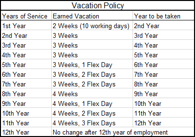

# MAP

> Mom's Attendance Program,
> for medium size business HR

A simple attendance tracking program for tracking employee time off. This includes several types of leave taking such 
as holiday and sick leave, with the option of adding other types of leave with lessened functionality (In Development).
This project will be used by my mother, who finds that most software for mid-size business is inadequate for serving 
her needs as an HR professional because it is over-complicated and designed for larger systems and integrations.

I am interested in this project because I think that people may **use** it. My goal is to develop usable and clean 
software that is simple and effective for the user.

## Leave Tracking

### Holiday tracking

In this attendance program, holiday is accrued every year on the anniversary of the employee and is accumulated year by
year.

### Sick leave tracking

In this program, sick leave is accrued at a given rate (0.5 days default) per month and is reset on every calendar year

### Bereavement, LOA, custom types

Custom leaves can be specified, details to come (in development).

## TODO

### Structure

- [ ] Finalize the first draft of functionality available to an employee
- [ ] Construct the tests for functionality of "Employee" class
- [ ] Specify/test/implement Update method for Employee
- [ ] Finish the design of the leave classes
- [ ] State class needs to be designed
- [ ] Design console interface
- [ ] Determine structure of the interface for "Leave" and determine the implementations in its subtypes

### UI

Currently, the UI is a simple console UI. Further, the UI does not respond well to user typos, which will (possibly) be
updated in the near future.

That is to say, I don't know where to start, but I'm sure I'll figure it out
given about two days of google

# My User Stories
1. As a user I would like to Create an employee with a given anniversary, name and role
2. As a user I would like to Make that employee take leave on a certain day
3. As a user I would like to Return a list of the days when that leave was taken
4. As a user I would like to Track how much vacation time the employee has left
5. As a user I would like to Track how much  sick leave the employee has at the moment
6. As a user I would like to add notes on the leave taken
7. As a user I would like to take non-integer leave days
8. As a user I would like to Add a department for my employees
9. As a user I would like to Add a supervisor for the employee
10. Check the date and change state accordingly?
    (alt. change the date given some condition)
    (alt set date on program opening)
    This includes changing the month / year and the corresponding dependencies.
11. Accrue sick leave on a yearly or monthly basis
12. Accrue holiday on a yearly or monthly basis
13. Be able to save the state of the program on a given day (optionally)
14. Be able to load the state of a program on a different day (optionally)
15. (implied by 12.) have the program change state appropriately from initial day to current day